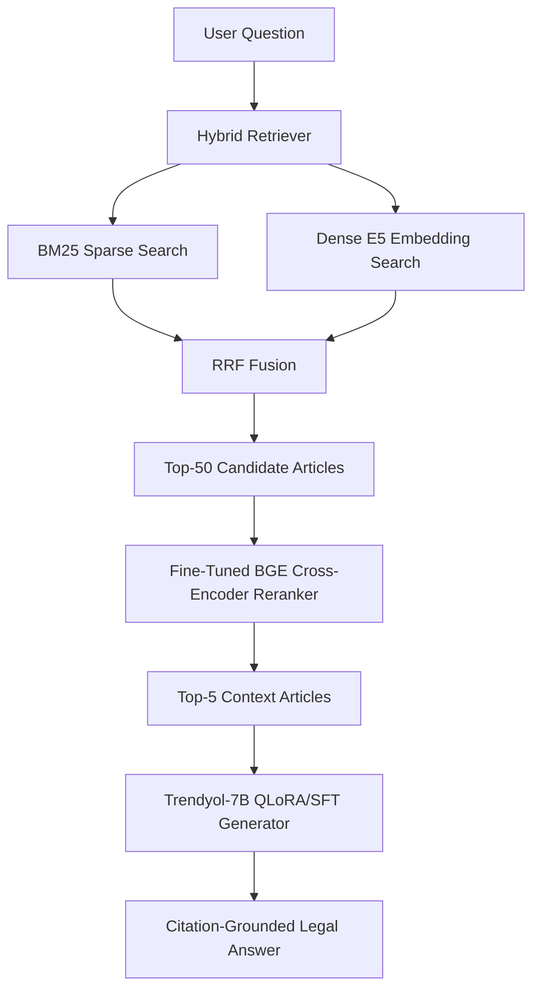

# HukukRAG — Turkish Legal RAG Pipeline

<p align="center">
  <b>Optimized Retrieval-Augmented Generation system for Turkish legal question answering with grounded citations.</b>
</p>

<p align="center">
  <a href="https://www.python.org/"></a>
  <a href="https://pytorch.org/"></a>
  <a href="https://huggingface.co/Trendyol/Trendyol-LLM-7B-chat-v4.1.0"></a>
  <a href="https://www.kaggle.com/datasets/hasanemreusta/turkish-legal-rag-system"></a>
  <a href="LICENSE"></a>
</p>

---

## Overview

**HukukRAG** is an end-to-end Turkish legal question-answering system built with a domain-adapted **Retrieval-Augmented Generation (RAG)** pipeline. The project focuses on Turkish statutory law and aims to answer legal questions by retrieving relevant legal articles, reranking them, and generating answers with explicit legal citations such as `[TCK m.299]`.

This repository was prepared as the **CENG493 Natural Language Processing Term Project**. The system is designed around a key problem in legal NLP: general-purpose LLMs may produce fluent answers, but they often fail to retrieve the correct Turkish legal article, follow legal citation formats, or remain fully grounded in source text.

> **Important:** This project is an academic NLP/RAG system and is not a substitute for professional legal advice.

---

## Key Features

- **Turkish legal QA:** Built specifically for Turkish legislation and legal terminology.
- **Citation-aware generation:** Answers are expected to cite legal articles in `[LawShortName m.ArticleNo]` format.
- **Hybrid retrieval:** Combines sparse BM25 retrieval with dense embedding retrieval.
- **Fine-tuned embedding model:** Uses a Turkish legal adaptation of `intfloat/multilingual-e5-large`.
- **Cross-encoder reranking:** Applies a fine-tuned BGE reranker to improve passage ordering.
- **Fine-tuned generator:** Uses `Trendyol/Trendyol-LLM-7B-chat-v4.1.0` with QLoRA/SFT adaptation.
- **Ablation-based evaluation:** Measures the contribution of retrieval, embedding, reranking, and LLM fine-tuning separately.
- **Reproducible notebooks:** Includes Kaggle/Colab notebooks for fine-tuning, index building, evaluation, and demo usage.

---

## System Architecture



The pipeline follows a three-stage RAG design:

1. **Retriever** finds candidate legal articles using BM25 and dense embeddings.
2. **Reranker** reorders candidates using a cross-encoder model.
3. **Generator** produces an answer grounded in the retrieved legal context.

---

## Model Components

| Component | Base Model / Method | Role | Adaptation |
|---|---|---|---|
| Sparse Retriever | BM25 | Lexical matching | Turkish-aware preprocessing |
| Dense Retriever | `intfloat/multilingual-e5-large` | Semantic retrieval | LoRA fine-tuning with hard negatives |
| Fusion | Reciprocal Rank Fusion | Combines BM25 + dense results | RRF over candidate rankings |
| Reranker | `BAAI/bge-reranker-v2-m3` | Precise relevance ranking | LoRA fine-tuning |
| Generator | `Trendyol/Trendyol-LLM-7B-chat-v4.1.0` | Citation-grounded answer generation | QLoRA 4-bit SFT |
| Judge | Claude Haiku | Faithfulness evaluation | RAGAS-style claim checking |

---

## Performance Summary

Main comparison between the baseline system and the fully optimized RAG pipeline on the development benchmark:

| Metric | A1 Baseline RAG | A5 Full FT-RAG | Improvement |
|---|---:|---:|---:|
| Recall@5 | 0.414 | 0.709 | +0.295 |
| Recall@10 | 0.480 | 0.803 | +0.323 |
| MRR@10 | 0.362 | 0.629 | +0.267 |
| Answer F1 | 0.227 | 0.359 | +0.132 |
| Citation F1 | 0.061 | 0.475 | +0.414 |
| Faithfulness | 0.615 | 0.704 | +0.089 |

The strongest improvement is observed in **Citation F1**, where the fully optimized pipeline achieves a significant gain over the BM25 + vanilla LLM baseline.

---

## Ablation Study

The project evaluates multiple system configurations to isolate the effect of each component.

| System | Embedding | Retrieval | Reranker | LLM | Recall@10 | Citation F1 |
|---|---|---|---|---|---:|---:|
| A1 | Base E5 | BM25 | None | Vanilla | 0.480 | 0.061 |
| A2 | Base E5 | Hybrid | None | Vanilla | 0.676 | 0.100 |
| A3 | Base E5 | Hybrid | BGE Pretrained | Vanilla | 0.721 | 0.128 |
| A4 | Base E5 | Hybrid | BGE Fine-Tuned | Vanilla | 0.746 | 0.105 |
| A5 | E5 Fine-Tuned | Hybrid | BGE Fine-Tuned | Trendyol SFT | 0.803 | 0.475 |
| A5a | E5 Fine-Tuned | Hybrid | BGE Fine-Tuned | Vanilla | 0.803 | 0.135 |
| A5b | Base E5 | Hybrid | BGE Fine-Tuned | Trendyol SFT | 0.746 | 0.454 |
| A5c | E5 Fine-Tuned | Hybrid | BGE Pretrained | Trendyol SFT | 0.779 | 0.456 |

Key takeaway: **LLM supervised fine-tuning provides the largest citation-quality gain**, while embedding and reranker fine-tuning improve retrieval quality and ranking stability.

---

## Data

The system is built around Turkish legal texts and evaluation data.

| Data Type | Description |
|---|---|
| Legal corpus | Parsed Turkish legal articles from `mevzuat.gov.tr` |
| Synthetic QA | Generated Turkish legal question-answer pairs with citation constraints |
| Hard negatives | BM25-mined difficult negative samples for embedding training |
| External QA | Turkish legal QA datasets used for SFT mixing |
| Gold benchmark | Manually prepared legal QA benchmark used only for evaluation |

The project includes data preparation scripts for scraping, parsing, normalization, hard-negative mining, and benchmark evaluation.

---

## Repository Structure

```text
NLP-RAG/
├── data/
│   ├── corpus/              # Parsed legal article corpus
│   ├── finetune/            # Synthetic QA, hard negatives, SFT data
│   ├── scrape/              # Scraped source documents and metadata
│   └── test_set/            # Gold benchmark files
├── docs/
│   └── PROJECT_OVERVIEW.md  # Detailed Turkish system overview
├── notebooks/
│   ├── 01_embedding_finetune.ipynb
│   ├── 02_reranker_finetune.ipynb
│   ├── 03_llm_sft.ipynb
│   ├── 04_ablation_eval.ipynb
│   ├── 05_build_ft_index.ipynb
│   ├── 06_faithfulness_judge.ipynb
│   └── colab_demo.ipynb
├── report/
│   ├── REPORT.md
│   └── REPORT.docx
├── results/
│   ├── ablation_summary.csv
│   ├── category_breakdown.csv
│   ├── faithfulness_summary.json
│   └── reranker_training.csv
├── src/
│   ├── demo/                # Demo-related code
│   ├── embedding/           # Embedding fine-tuning and hard-negative mining
│   ├── eval/                # Evaluation metrics and runners
│   ├── ingest/              # Scraping, parsing, and data normalization
│   ├── llm/                 # LLM backends and generation utilities
│   ├── pipeline/            # End-to-end RAG pipeline
│   ├── reranker/            # Cross-encoder reranking
│   └── retrieval/           # BM25, FAISS, dense and hybrid retrieval
├── LINKS.md
├── LICENSE
├── README.md
└── requirements.txt
```

---

## Installation

### 1. Clone the repository

```bash
git clone https://github.com/gokaycetinn/NLP-RAG.git
cd NLP-RAG
```

### 2. Create a virtual environment

```bash
python -m venv .venv
source .venv/bin/activate      # macOS / Linux
# .venv\Scripts\activate       # Windows
```

### 3. Install dependencies

```bash
pip install --upgrade pip
pip install -r requirements.txt
```

> Some LLM and fine-tuning workflows require a CUDA-enabled GPU. Retrieval-only and evaluation utilities can be run with lighter hardware depending on the selected backend.

---

## Download Models and Index Files

The fine-tuned models, adapters, indices, and prepared system files are provided through Kaggle.

```bash
pip install kaggle

# Make sure your Kaggle API token is available at ~/.kaggle/kaggle.json
kaggle datasets download -d hasanemreusta/turkish-legal-rag-system -p data --unzip
```

Fine-tuning datasets are available separately:

```bash
kaggle datasets download -d hasanemreusta/turkish-legal-rag-finetune -p data/finetune --unzip
```

---

## Quick Demo

The easiest way to try the system is through the Colab demo notebook:

[](notebooks/colab_demo.ipynb)

Open the notebook, run all cells, and use the generated Gradio URL to ask Turkish legal questions.

Example question:

```text
Cumhurbaşkanına hakaret eden birine ne ceza verilir?
```

Expected answer style:

```text
Cumhurbaşkanına hakaret eden kişi ilgili kanun maddesine göre hapis cezası ile cezalandırılır. [TCK m.299]
```

---

## Running Evaluation

### Baseline BM25 + Vanilla LLM

```bash
python -m src.eval.run_eval \
  --test data/test_set/dev_full.jsonl \
  --index-dir data/index_full \
  --mode bm25 \
  --llm-backend hf \
  --hf-model Trendyol/Trendyol-LLM-7B-chat-v4.1.0 \
  --out results/A1
```

### Full Fine-Tuned RAG Pipeline

```bash
python -m src.eval.run_eval \
  --test data/test_set/dev_full.jsonl \
  --index-dir data/index_full \
  --embed-model data/models/e5-large-tr-legal \
  --mode hybrid \
  --reranker v2 \
  --reranker-dir data/models/bge-reranker-tr-legal-v2 \
  --llm-backend hf \
  --hf-model Trendyol/Trendyol-LLM-7B-chat-v4.1.0 \
  --adapter-path data/models/llm_adapter \
  --out results/A5
```

---

## Training and Experiment Notebooks

| Notebook | Purpose |
|---|---|
| `01_embedding_finetune.ipynb` | Fine-tunes multilingual E5 embeddings with hard negatives |
| `02_reranker_finetune.ipynb` | Fine-tunes the reranker model |
| `03_llm_sft.ipynb` | Performs QLoRA SFT for the Trendyol-7B generator |
| `04_ablation_eval.ipynb` | Runs the 8-cell ablation evaluation |
| `05_build_ft_index.ipynb` | Builds the FAISS index with the fine-tuned embedding model |
| `06_faithfulness_judge.ipynb` | Evaluates faithfulness with an LLM judge |
| `colab_demo.ipynb` | Runs an interactive Gradio demo |

---

## Evaluation Metrics

The system is evaluated with retrieval, generation, citation, and faithfulness metrics:

| Metric | Meaning |
|---|---|
| Recall@K | Whether the correct legal article appears in the top-K retrieved results |
| MRR@10 | Ranking quality of the first relevant result |
| nDCG@10 | Ranking quality with graded relevance |
| Answer F1 | Token-level similarity between generated and reference answers |
| BLEU / ROUGE-L | Text overlap metrics for generated answers |
| Citation Precision / Recall / F1 | Correctness of cited law/article pairs |
| Faithfulness | Whether the generated answer is supported by retrieved context |

---

## Project Links

| Resource | Link |
|---|---|
| Model and index dataset | https://www.kaggle.com/datasets/hasanemreusta/turkish-legal-rag-system |
| Fine-tuning dataset | https://www.kaggle.com/datasets/hasanemreusta/turkish-legal-rag-finetune |
| Technical report | `report/REPORT.md` |
| System overview | `docs/PROJECT_OVERVIEW.md` |
| Ablation results | `results/ablation_summary.csv` |
| Demo notebook | `notebooks/colab_demo.ipynb` |

---

## Team

| Name | Role / Contribution Area |
|---|---|
| Hasan Emre Usta | RAG pipeline, evaluation, system integration |
| Ömer Altıntaş | Data preparation, experiments, reporting |
| Kayra Dalçık | Dataset processing, testing, analysis |
| Gökay Çetinakdoğan | NLP pipeline support, evaluation, documentation |

---

## License

This project is licensed under the **MIT License**. See the [`LICENSE`](LICENSE) file for details.

---

## Acknowledgements

This project was developed for **CENG493 — Natural Language Processing**. It uses open-source NLP libraries, Turkish legal resources, Hugging Face models, Kaggle notebooks, and publicly available Turkish legislation from `mevzuat.gov.tr`.
